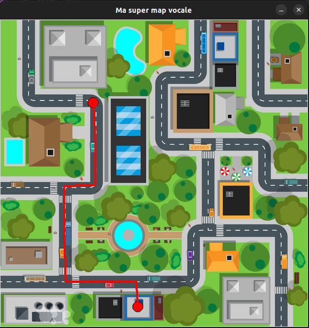
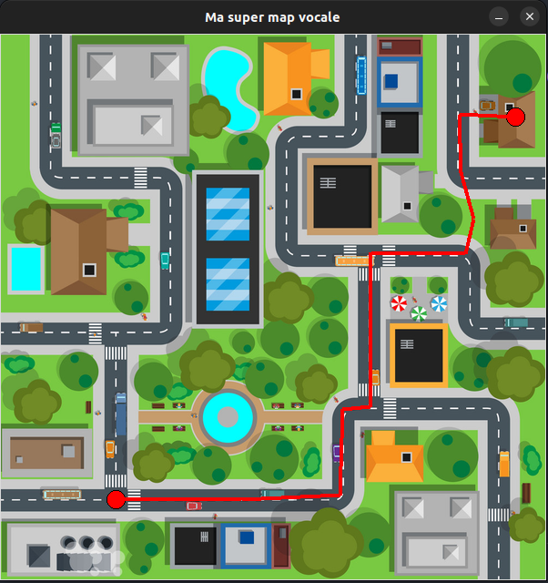

# Multi-maps

Small python application as a proof-of-concept for muti-modal fusion for human-to-robot interaction.

The app shows a mapof a city with multiple points of interest (POI). The user can ask for directions by :
1. specifying a starting point on the map using a pointer (mouse, eyetracker, etc.)
2. specifying a destination using speech 


## Installation

1. On Ubuntu, install `portaudio` and `tkinter` for the voice recognition & UI to work

```bash
sudo apt install portaudio19-dev -y
sudo apt install python3-tk -y
```

2. Create a Python 3.10 environment (conda, venv, or other)
3. Install project dependencies

```bash
pip install -U pip
pip install -r ./requirements.txt
```

## Run the app

Source the python environment then

```bash
python src/main.py
```

## How to use

1. Click on your position on the map
2. The system will ask you where you want to go and wait for your answer
3. Say where you wish to go.
4. A red line will be drawn from your position to the destination by taking the shortest path possible

The possible destinations are : 
- The school
- The university
- The library
- The cinema
- The bus station
- The train
- The mall
- The Post office
- The park
- Home

## Examples

### Example 1 : Bus Station
```
Voice input : I want to go to the bus station
```


### Example 2 : Home
```
Voice input : I want to go to Home
```


## How it works

The software leverages the multi-modality to enhance the user experience and allows for multiple ways of interacting with the machine for more flexibility.

The mouse click followed by the vocal command makes it so the user can ask for a destination event if he does not know where it is located. Furthermore, we thought about swapping the mouse click with an eye tracker to make our app usable by people who are not capable of efficiently using a mouse and keyboard.

**Interaction timeline**
```
-------|click|---------------------------------------------
-------------|voice command                   |------------
```